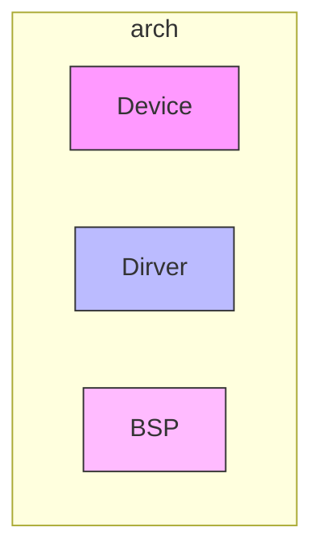
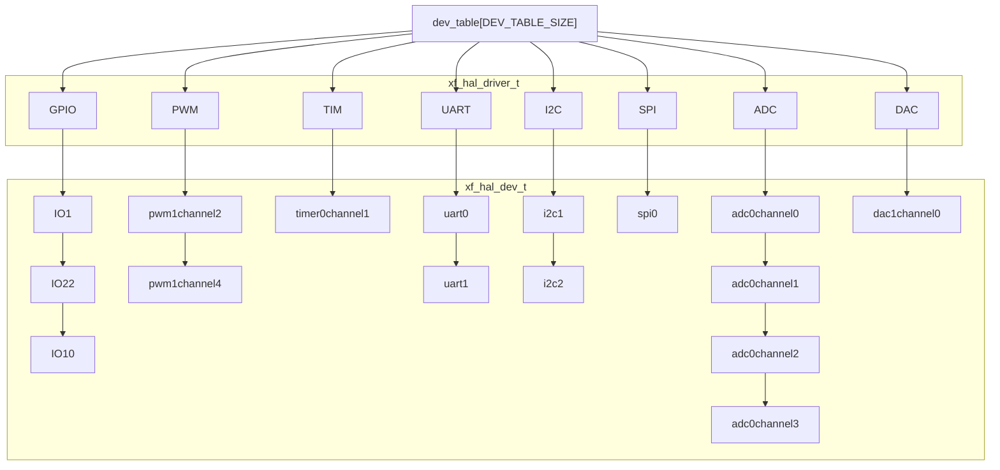

# XF HAL 设备抽象层

## 特点
1. 移植对接简单统一， 所有移植对接只需要移植 open close ioctrl read wirte即可
2. 上层调用API更加贴近用户层
3. 支持类posix接口调用
4. 仅依赖xf_utils， 方便移植到任何设备上
5. 所有外设都支持独立的屏蔽
6. 支持对接锁，防止多任务竞争
7. 方便添加新的外设

## 开源链接

[github](https://github.com/x-eks-fusion/xf_hal)

[gitee](https://gitee.com/x-eks-fusion/xf_hal)

## 背景

在嵌入式开发中，往往芯片不同，其sdk也不同。即使都是使用gpio去点灯，也会因为函数不同而不能通用。每个sdk都需要去熟悉，导致学习成本和代码书写成本增加。

和hal相关的设计有很多，常见的有stm32的hal库，posix的外设接口等。

stm32的hal库的接口可能适合其自身，但是拓展到如果兼容所有芯片，其接口就无法满足所有mcu的需求。
posix的接口比较统一。但是在这种高度统一化的操作背后，实际上这种操作在使用者角度上比较困扰。

于是我们结合上述的方式， 形成xf_hal的设备抽象层。

## xf_hal 的结构和原理

xf_hal 的源码文件夹中，分为kernel和device。其中kernel是其核心部分，device部分则可以自由新增抽象层。
整体的结构如下：



细节结构图如下：



### kernel的结构

#### 全局静态数组 dev_table

```c
static xf_hal_driver_t dev_table[DEV_TABLE_SIZE] = {0};
```

这是一个全局静态数组，是所有设备的起点。所有设备通过它可以遍历。其个数为 DEV_TABLE_SIZE ，这个宏的定义为：

```c
typedef enum _xf_hal_type_t {
#define XF_HAL_TABLE_TYPE
#include "../device/xf_hal_reg_table.inc"
    XF_HAL_TYPE_MAX
} xf_hal_type_t;
```
通过device文件夹中的“注册表” xf_hal_reg_table.inc，预编译阶段生成枚举对象。所以 XF_HAL_TYPE_MAX 自然是所有注册的外设。
dev_table 数组中的每个 xf_hal_driver_t 对象。对应着已经注册的外设中的每个外设。

#### 内部对象 xf_hal_driver_t

```c
typedef struct _xf_hal_driver_t {
    xf_list_t dev_list;
    uint32_t flag : 16;
    uint32_t dev_count : 16;
    xf_driver_ops_t driver_ops;
    xf_hal_dev_create_t constructor;
#if XF_HAL_LOCK_IS_ENABLE
    void *mutex;
#endif
} xf_hal_driver_t;
```

这是一个内部的对象(外部无法访问)，他代表了通用的外设驱动的类型。
- 其中包含了dev_list，这里是用于挂载具体外设的链表。 
- flag表示其本身的读写的标志。
- dev_count则表示挂载在这上面的外设的数量。
- driver_ops表示其操作函数，主要有open， ioctl， read， write，close。这部分会在底层做对接。
- constructor则是有外设层带来的
- mutex 这部分则是考虑到多任务的线程保护，需要在 xf_hal_config.h中设置XF_HAL_LOCK_DISABLE为0，方可开启。

我们的静态数组中有多少外设就有多少 xf_hal_driver_t 对象。这个对象主要用来保存对接的操作函数 driver_ops 的。其下挂载的就是实际使用的设备。

#### 设备调用流程

每当设备（例如：GPIO）开始调用时，都要通过 xf_hal_driver_create（本质是constructor） 构造函数构造一个指定类型、指定ID的 xf_hal_dev_t 对象。这个对象会在 open 阶段，挂载到指定 xf_hal_driver_t 对象下面。然后经过 ioctrl 阶段进行配置参数。那么就可以通过 write、read 操作设备。最后，通过close，解除挂载并回收内存。

所以，针对移植者来说。无论任何的设备只需要对接好，以下五个回调函数即可：

```c
typedef struct _xf_driver_ops_t {
    xf_err_t (*open)(xf_hal_dev_t *dev);
    xf_err_t (*ioctl)(xf_hal_dev_t *dev, uint32_t cmd, void *config);
    int (*read)(xf_hal_dev_t *dev, void *buf, size_t count);
    int (*write)(xf_hal_dev_t *dev, const void *buf, size_t count);
    xf_err_t (*close)(xf_hal_dev_t *dev);
} xf_driver_ops_t;
```

然而正如我之前所说，对于应用者来说。这五个操作函数（类posix）并不直观。

所以，在此之上，有了更加偏向应用层的封装。

### device 的结构和原理

kernel 基本上确定了整体的设备管理框架。但是具体设备如何方便添加呢？

这里就时我们设置device文件夹的意义。一个新的device添加是和kernel是解耦的。

kernel中的device对象：
```c
typedef struct _xf_hal_dev_t {
    xf_list_t node;
    uint32_t type;              /*!< 保存外设类型 */
    uint32_t id;                /*!< id 用于保存设备唯一标识符 */
    void *platform_data;        /*!< 用户通过该参数穿越不同的 ops 之间 */
#if XF_HAL_LOCK_IS_ENABLE
    void *mutex;
#endif
} xf_hal_dev_t;
```
所有的具体设备类都需要继承 xf_hal_dev_t 类。

例如：我们需要添加一个 PWM 设备：

1. 创建 xf_hal_pwm.c/.h

2. 将外设名称写入 xf_hal_reg_table.inc 注册表中。
```c
XF_HAL_REG(PWM)
```

3. 在 xf_hal_pwm.c 中创建自己的 pwm 设备类：
```c
typedef struct _xf_hal_pwm_config_t {
    bool enable;                /*!< 启用参数，0 为禁用，1 为启用 */
    uint32_t freq;              /*!< 频率参数，设置 pwm 频率单位为 hz */
    uint32_t duty;              /*!< 占空比参数，设置 duty ，最大值为 `2^duty_resolution - 1` */
    uint32_t duty_resolution;   /*!< 占空比分辨率参数，直接影响 duty 的最大值 */
    xf_gpio_num_t io_num;       /*!< 输出 IO 参数，指定 pwm 的输出 io */
} xf_hal_pwm_config_t;

typedef struct _xf_hal_pwm_t {
    xf_hal_dev_t dev; // 一定要放到第一个，以便后续close一起free
    xf_hal_pwm_config_t config;
} xf_hal_pwm_t;
```
这个设备类中，需要我们将 dev 放到第一个做继承。config则是pwm需要ioctrl可以配置的内容

4. 在 xf_hal_pwm.c 实现底层注册函数
```c
#define XF_HAL_PWM_TYPE XF_HAL_PWM

xf_err_t xf_hal_pwm_register(const xf_driver_ops_t *driver_ops)
{
    return xf_hal_driver_register(XF_HAL_PWM_TYPE, XF_HAL_FLAG_ONLY_READ, pwm_constructor, driver_ops);
}
```
可以看到本质上调用的是 xf_hal_driver_register 其中第一个参数是类型，这个通过之前的注册表会生成 XF_HAL_PWM 宏。这里指定为 XF_HAL_PWM 就行。第二个是flag。我们采用只读模式即可。第三个是构造函数：
```c
static xf_hal_dev_t *pwm_constructor(xf_pwm_num_t pwm_num)
{
    xf_err_t err = XF_OK;
    xf_hal_dev_t *dev = NULL;
    xf_hal_pwm_t *dev_pwm = (xf_hal_pwm_t *)xf_malloc(sizeof(xf_hal_pwm_t));
    XF_ASSERT(dev_pwm, NULL, TAG, "memory alloc failed!");

    dev = (xf_hal_dev_t *)dev_pwm;

    err = xf_hal_driver_open(dev, XF_HAL_PWM_TYPE, pwm_num);

    if (err) {
        XF_LOGE(TAG, "open failed!");
        xf_free(dev);
        return NULL;
    }

    return dev;
}
```
构造函数本身是帮我们构造了一个 xf_hal_pwm_t 大小的内存，并返回给底层。
底层拿到这个例程后完成

5. 在 xf_hal_port.h 添加自己的底层注册函数
```c
xf_err_t xf_hal_pwm_register(const xf_driver_ops_t *driver_ops);
```

6. 封装 open close read write ioctrl 。简化应用层调用

```c
xf_err_t xf_hal_pwm_set_duty(xf_pwm_num_t pwm_num, uint32_t duty)
{
    xf_err_t err = XF_OK;

    xf_hal_dev_t *dev = xf_hal_device_find(XF_HAL_PWM_TYPE, pwm_num);
    xf_hal_pwm_t *dev_pwm = (xf_hal_pwm_t *)dev;
    XF_HAL_PWM_CHECK(!dev_pwm, XF_ERR_INVALID_ARG, "pwm is not init!");

#if XF_HAL_LOCK_IS_ENABLE
    xf_lock_lock(dev_pwm->dev.mutex);
#endif

    dev_pwm->config.duty = duty;

#if XF_HAL_LOCK_IS_ENABLE
    xf_lock_unlock(dev_pwm->dev.mutex);
#endif

    err = xf_hal_driver_ioctl(dev, XF_HAL_PWM_CMD_DUTY, &dev_pwm->config);
    XF_HAL_PWM_CHECK(err, err, "config failed!");

    return XF_OK;
}
```

#### xf_hal 总结

对于移植层来说，xf_hal提供了统一的五种对接函数。对于应用层来说，xf_hal 提供更加贴近用户使用习惯的api，方便用户调用。

## 如何使用例程

1. 安装[xmake](https://xmake.io/#/zh-cn/guide/installation)
2. 获取xf_utils
```shell
git clone https://github.com/x-eks-fusion/xf_utils.git
```
3. 安装gcc gdb工具链
```shell
sudo apt install gcc -y
sudo apt install gdb -y
```
4. 编译
```shell
xmake
```
5. 运行
```shell
xmake r
```
